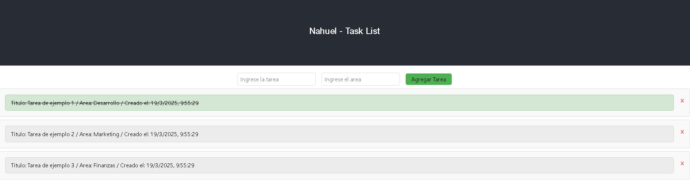

# Lista de Tareas - React App Challenge ingreso a Academia ForIT 2025


## Descripción

Una aplicación simple de lista de tareas (To-Do List) desarrollada con React. Permite agregar, eliminar y marcar tareas como completadas. Las tareas se almacenan en una base de datos utilizando una API backend.

Esta aplicación permite a los usuarios:

- Agregar nuevas tareas con un título y un área.
- Marcar tareas como completadas o incompletas.
- Eliminar tareas de la lista.

## Tecnologías utilizadas

- **Frontend**: React vite
- **Backend**: Node.js, Sequelize, dontEnv, cors, Swagger
- **Estado**: React hooks (`useState`, `useEffect`)
- **Estilo**: CSS

## Instalación

### Requisitos

1. Node.js 
2. React.js 
### Pasos para instalar

1. Clona el repositorio en tu máquina local e instala las dependencias backend:

   ```bash
   git clone <https://github.com/Aubar48/task_list>
   Instala las dependencias del backend
   cd <backend> 
   cd <task_list>
   npm install
   npx sequelize-cli db:migrate correr migracion
   npx sequelize-cli db:seed:all para insertar los datos.
   node index.js

2. Instala las dependencias del frontend:

   ```bash
   cd <frontend> 
   cd <task_list>
   npm install
   npm run dev

3. Instala las dependencias de cypress:
   
   ```bash
   cd <testing> 
   npm install
   npx cypress open
   npx cypress run


4. Si aún no tienes una API backend corriendo, asegúrate de tenerla disponible en http://localhost:3000/api/tasks. Si no tienes una API configurada, necesitarás crearla o conectarte a una API que gestione las tareas " USA ENV EXAMPLE".

La API debe tener las siguientes rutas:

- GET /api/tasks: Obtiene todas las tareas.
- POST /api/tasks: Crea una nueva tarea.
- DELETE /api/tasks/:id: Elimina una tarea por su ID.
- PUT /api/tasks/:id: Actualiza el estado de una tarea.

Swagger
La API también incluye Swagger para documentar y probar los endpoints de manera visual. Para acceder a la documentación interactiva de la API, abre tu navegador y dirígete a:

- http://localhost:3000/api-docs

USO FRONTEND REACT VITE: 
- http://localhost:5173/
<figure></figure>

1. Agregar una tarea: Ingresa el título y el área de la tarea en los campos correspondientes y haz clic en el botón "Agregar Tarea".
2. Marcar una tarea como completada: Haz clic en el botón "Marcar como completa" o "Marcar como incompleta" para cambiar el estado de la tarea.
3. Eliminar una tarea: Haz clic en el botón "Eliminar" para eliminar una tarea de la lista.
Estructura del Proyecto
